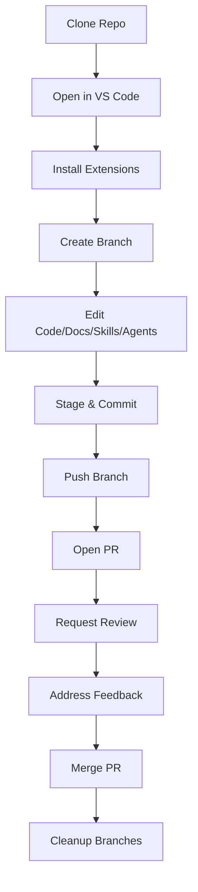

# GitHub + VS Code IDE Workflow (with Copilot, Skills, and Agents)

---

## Workflow Diagram



---

## Key Commands Table
| Action                | Command/Shortcut                        |
|-----------------------|-----------------------------------------|
| Clone repo            | `git clone <repo-url>`                  |
| Create branch         | `git checkout -b feature/your-feature`  |
| Stage changes         | `git add .`                             |
| Commit                | `git commit -m "message"`              |
| Push branch           | `git push origin feature/your-feature`  |
| Preview markdown      | `Ctrl+Shift+V` or Markdown Preview      |
| Export markdown to PDF| `pandoc file.md -o file.pdf`            |

---

## 1. Project Setup
- Clone the repository and open in VS Code.
- Install recommended extensions:
  - GitHub Pull Requests and Issues
  - Markdown Preview Enhanced
  - Python (if using Python)

## 2. Branching & Commits
- Create a new branch for your work.
- Make changes (code, docs, skills, agents).
- Stage and commit with clear messages.

## 3. Working with Issues
- View, create, and update issues in the GitHub panel.
- Reference issues in commits (e.g., `Fixes #123`).

## 4. Pull Requests (PRs)
- Push your branch and open a PR.
- Link issues and assign reviewers.
- Use the "address-pr-comments" skill for review feedback.
- Push updates to your branch as needed.

## 5. Skill & Agent Integration
- Select skills using the [Skill Routing Guide](/Notebooks/.github/instructions/create.instructions.md).
- Add/update skills in `/AI/skills/` and agents in `/AI/agents/`.
- Document usage in markdown files for each skill/agent.

## 6. Markdown & Documentation
- Preview markdown with `Ctrl+Shift+V` or Markdown Preview Enhanced.
- Export to PDF with Markdown Preview Enhanced or Pandoc.

## 7. Merging & Cleanup
- Merge PRs after approval.
- Delete merged branches locally and remotely.

## 8. Troubleshooting
- **Startup/environment issues:** See [Startup Troubleshooting](/Notebooks/.github/instructions/startup-environment.instructions.md).
- **Skill/agent issues:** Use the "agent-customization" skill for debugging customization files.
- **Common GitHub/VS Code issues:**
  - Extension not working: Reload VS Code, check extension settings.
  - PR not updating: Ensure branch is pushed, refresh PR panel.
  - Markdown not rendering: Check for syntax errors, use preview.

---

## 9. Best Practices Checklist
- [ ] Write clear commit messages and PR descriptions.
- [ ] Keep branches focused and small.
- [ ] Use skills and agents to automate repetitive tasks.
- [ ] Keep documentation up to date.
- [ ] Reference issues and link PRs.
- [ ] Review and test before merging.

---

## 10. Use Case Table
| Scenario                | Key Steps/Settings                                 | Skills/Agents Used           |
|-------------------------|----------------------------------------------------|------------------------------|
| Bugfix                  | Branch → Fix → PR → Review → Merge                 | address-pr-comments, skills  |
| New Feature             | Branch → Implement → PR → Review → Merge           | custom agent, skills         |
| Documentation Update    | Branch → Edit .md → PR → Merge                     | markdown, none/skills        |
| Skill/Agent Update      | Branch → Edit/Add → PR → Test → Merge              | agent-customization, skills  |

---

## 11. Commit & PR Templates
**Commit Message Example:**
```
feat: add new agent for workflow automation

- Implements agent for auto-updating markdown files
- Updates documentation
- Closes #42
```

**PR Description Example:**
```
### Summary
Adds a new agent for automating markdown file updates.

### Related Issues
Closes #42

### Checklist
- [x] Code tested
- [x] Docs updated
- [x] Reviewers assigned
```

---

## 12. Optimizing with Copilot, Skills, and Agents
- Use Copilot for code suggestions and documentation.
- Leverage skills for workflow automation (e.g., summarizing PRs, addressing comments).
- Create custom agents for specialized tasks (see [Custom_Agents.md](../Manuals/Custom_Agents.md)).
- Regularly review and update skills/agents for evolving workflows.

---

## References & Cross-Links
- [Skill Routing Guide](/Notebooks/.github/instructions/create.instructions.md)
- [Custom Agents Manual](../Manuals/Custom_Agents.md)
- [Prompt Files Manual](../Manuals/Prompt_Files.md)
- [Skills Manual](../Manuals/Skills.md)
- [Instructions & Rules Manual](../Manuals/Instructions_and_Rules.md)
- [Hooks Manual](../Manuals/Hooks.md)
- [MCP Servers Manual](../Manuals/MCP_Servers.md)
- [Tool Sets Manual](../Manuals/Tool_Sets.md)
- [Plugins Manual](../Manuals/Plugins.md)
- [Chat Settings Manual](../Manuals/Chat_Settings.md)
- [Markdown Instructions](/Notebooks/markdown_instructions_and_example.md)
- [Startup Troubleshooting](/Notebooks/.github/instructions/startup-environment.instructions.md)

---

*Save this file as `github-ide-workflow.md` for future reference.*

---

## Script: Auto-Update Markdown Files

Create a script (e.g., `auto_update_markdown.sh`) to update all .md files in a directory:

```bash
#!/bin/bash
# Auto-update all .md files in the specified directory (e.g., run formatting, linting, or custom update logic)

TARGET_DIR="${1:-.}"

for file in "$TARGET_DIR"/*.md; do
  echo "Updating $file..."
  # Example: format with prettier (if installed)
  # prettier --write "$file"
  # Or run a custom Python script:
  # python3 update_markdown.py "$file"
  # Add your update logic here
  echo "$file updated."
done

echo "All markdown files updated."
```

Make it executable:
```
chmod +x auto_update_markdown.sh
```

Run it:
```
./auto_update_markdown.sh /path/to/markdowns
```
